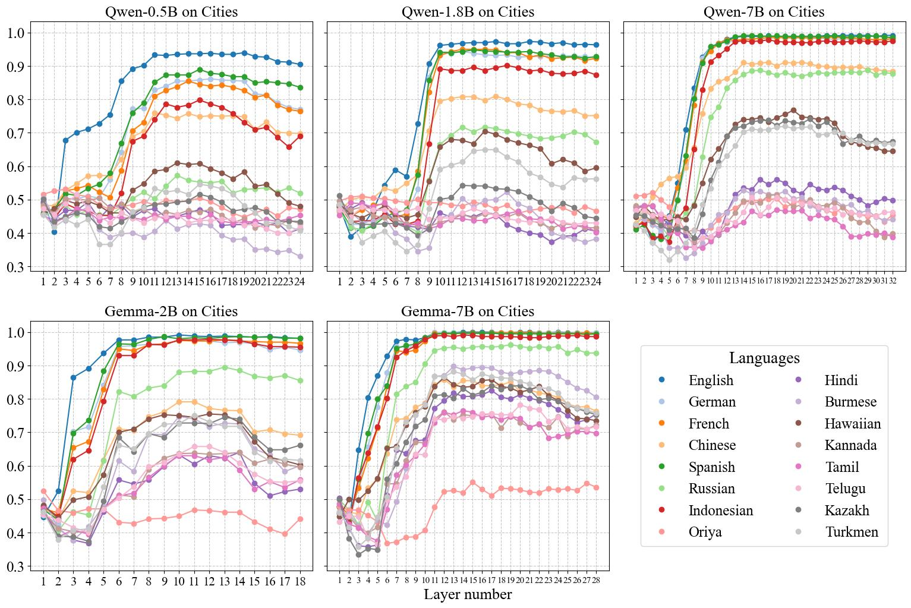

# Exploring Multilingual Probing in Large Language Models: A Cross-Language Analysis

Official Repository for Paper: Exploring Multilingual Probing in Large Language Models: A Cross-Language Analysis

Paper link: https://arxiv.org/abs/2409.14459 
<br>
<br>



Figure 1: Layer-wise probing accuracy of 5 open-source LLMs across 16 languages.


## Contact

Daoyang Li: daoyangl@usc.edu

## Citation

If you use this code please cite our paper:

```bibtex
@misc{li2024exploringmultilingualprobinglarge,
      title={Exploring Multilingual Probing in Large Language Models: A Cross-Language Analysis}, 
      author={Daoyang Li and Mingyu Jin and Qingcheng Zeng and Haiyan Zhao and Mengnan Du},
      year={2024},
      eprint={2409.14459},
      archivePrefix={arXiv},
      primaryClass={cs.CL},
      url={https://arxiv.org/abs/2409.14459}
}
